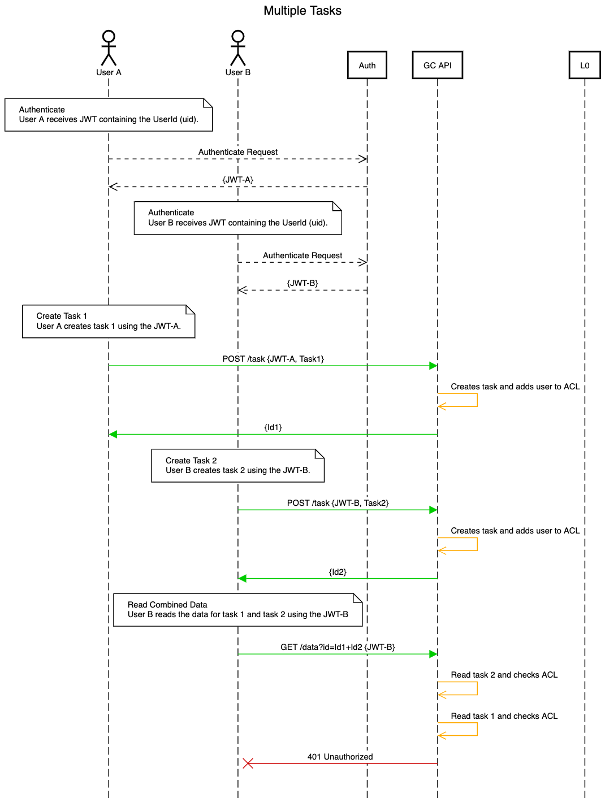
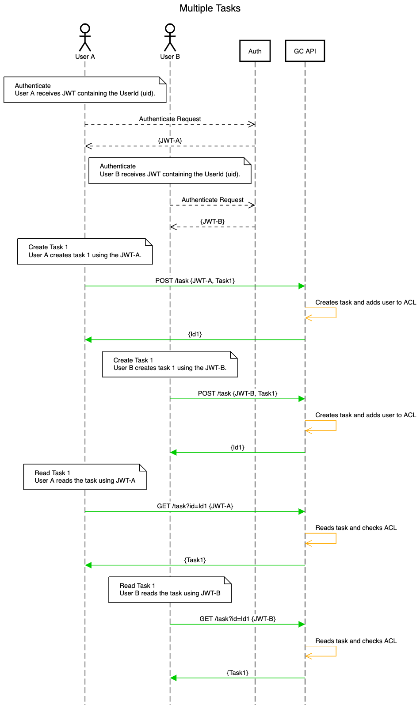

Authorization
---
This document describes how Graffiticode API handles authorization. Currently the `/task` and `/data` endpoints will used authorization to provide access control to `Task`s and `Data`s.

## General philosophy
A user can read a task that user creates

- Senario 1
  ```
  User A creates Task Foo and receives Id 1
  User A reads Id 1 and gets Task Foo
  ```

- Senario 2
  ```
  User A creates Task Foo and receives Id 1
  User B reads Id 1 and gets a 401 error
  ```

- Senario 
  ```
  User A creates Task Foo and receives Id 1
  User B creates Task Foo and receives Id 1
  User A reads Id 1 and gets Task Foo
  User B reads Id 1 and gets Task Foo
  ```

## Diagrams

### Single Task


### Single Task Unauthorizaed


### Multiple 


### Multiple Tasks Unauthorizaed


### Multiple Users, Same Task


## How to update these diagrams

1. Go to https://sequencediagram.org/
1. Open the diagram to be modified
1. Modify the diagram
1. Save the diagram
1. Export the png
